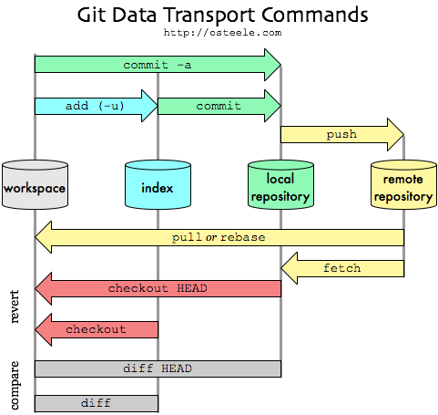

# Git cheatsheet

> My personal Git cheatsheet.

## Editing

### Edit last local commit message

`git commit --amend --only -m 'A new message that will override the original message.'`

### Move changes from one branch to another

`git checkout target_branch path/to/file/relative/to/current/location.cs`

## Reverting

### Revert last commit (keep changes)

`git reset HEAD~1`

### Revert last commit (discard changes)

`git reset --hard HEAD~1`

## Data collection

### Different files between two branches

`git checkout source_branch; git diff target_branch --name-only`

## How to write a good commit message

* Separate subject from body with a blank line.
* Limit the subject line to 50 characters.
* Capitalize the subject line.
* Do not end the subject line with a period.
* Use the imperative mood in the subject line, see below.
* Wrap the body at 72 characters.
* Use the body to explain what and why vs. how.

An imperative mood is when you do not use past tense or similar. You basically fill up this template: *If applied, this commit will* **your subject line**.

Limits for 50/72 characters are soft limits. I personally don't like the latter limit because there is no technical reason for that. It's just derived from [IBM punch cards](https://en.wikipedia.org/wiki/Punched_card) which had 72+8 characters per line.

If you can't fit into 50 characters for a subject line, divide changes into multiple commits. Same advice apply when you have a tendency to use *and* in your subject line.

## Git structure

## Merge Strategies

### Explicit Merge

No fast forward.

### Fast Forward Merge

No new commit.

### Rebase

Maintains a linear history.

### Squash

No commit history and maintains a linear history.

## Links

1. [Best Git cheatsheet I came across](https://github.com/arslanbilal/git-cheat-sheet)
2. [Git Flight Rules](https://github.com/k88hudson/git-flight-rules)
3. [How to Write a Git commit message](https://chris.beams.io/posts/git-commit/)
